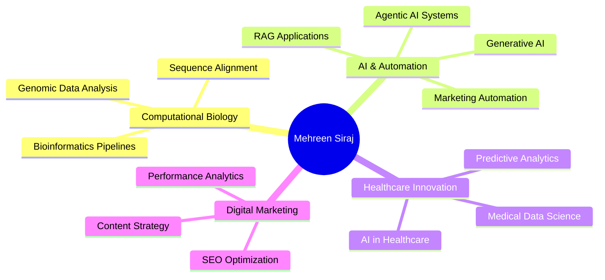

# 👋 Mehreen Siraj

### 🧬 Biochemist → 🤖 AI & Marketing Automation Specialist

*Bridging Life Sciences & AI to Drive Innovation in Research, Healthcare & Digital Marketing*

---

## 🎯 Professional Summary

**M.Phil. Biochemistry Graduate (CGPA 3.70/4.0)** with a unique fusion of wet-lab molecular biology expertise and cutting-edge AI/automation skills. Proven track record in research (DNA isolation, PCR, Sanger sequencing) and digital marketing (SEO, automation, content strategy). Currently specializing in **Computational Biology, Bioinformatics, and AI-driven solutions** for healthcare, research, and marketing domains.

**🌍 Location:** Pakistan | **💼 Status:** Actively seeking full-time remote opportunities | **🌟 Open to:** Sponsorship & Relocation

---

## 💡 Core Competencies

<table>
<tr>
<td width="50%" valign="top">

### 🧬 Life Sciences & Research
- **Molecular Biology:** DNA Isolation (CTAB), PCR Optimization, Gel Electrophoresis
- **Bioinformatics:** BLAST, GenBank, Primer Design, Sequence Analysis
- **Computational Biology:** Python for biological data, genomic data science
- **Research Excellence:** Published M.Phil. thesis on metalloprotein gene isolation

</td>
<td width="50%" valign="top">

### 🤖 AI & Automation
- **Generative AI:** RAG, Agentic AI, OpenAI/ChatGPT Integration
- **Automation Tools:** Make.com, n8n, Zapier
- **Microsoft Azure AI:** Intelligent application development
- **Machine Learning:** Python, Pandas, Scikit-Learn, Data Analysis
- **No-Code Development:** Workflow automation & process optimization

</td>
</tr>
<tr>
<td width="50%" valign="top">

### 📈 Digital Marketing & SEO
- **SEO Mastery:** Technical SEO, On-Page/Off-Page Optimization, Keyword Research
- **Analytics:** Google Analytics, Google Search Console, SEMrush, Ahrefs
- **Email Marketing:** Klaviyo, Mailchimp, HubSpot
- **Content Strategy:** WordPress, WooCommerce, Content Marketing
- **Social Media:** Multi-platform management & automation

</td>
<td width="50%" valign="top">

### 💻 Technical Skills
- **Programming:** Python, HTML5, CSS3, Markdown
- **Tools:** Linux, Jupyter, VS Code, Docker, GitHub
- **Project Management:** ClickUp (Certified Power User), Notion, Asana
- **CMS Platforms:** WordPress, Elementor, WooCommerce
- **Languages:** English (Fluent, IELTS Certified), Urdu (Native)

</td>
</tr>
</table>

---

## 🎓 Education

### **M.Phil. Biochemistry** | CGPA: 3.70/4.0
**University of Agriculture, Faisalabad** | *2019 – 2022*

**Thesis:** *Isolation and Characterization of Metalloprotein Genes (CotA & ResC) from Bacillus clausii KP10*
- Demonstrated end-to-end molecular biology workflow from primer design to sequence validation
- Combined wet-lab techniques with computational sequence analysis

### **M.Sc. Chemistry** | CGPA: 3.56/4.0
**Islamia University Bahawalpur** | *2015 – 2019*

---

## 💼 Professional Experience

### 🔬 **Research Scientist**
**Bioactive Molecular Research Lab (BMRL), University of Agriculture Faisalabad**  
*September 2020 – February 2022 | Faisalabad, Pakistan*

- Executed comprehensive molecular biology protocols: DNA isolation (CTAB method), PCR optimization, Sanger sequencing, and gel electrophoresis
- Designed and validated primers using NCBI GenBank, performed BLAST analysis for gene identification (CotA & ResC)
- Established integrated workflows connecting wet-lab experimental data to computational sequence analysis
- Contributed to research publications and laboratory protocol optimization

### 💼 **Top-Rated Freelancer** | **100% Job Success Score**
**Upwork** | *2022 – 2024 | Remote*

- Delivered premium SEO, content marketing, WordPress management, and social media services to international clients
- Achieved **Top-Rated Freelancer** status through consistent quality and client satisfaction
- Specialized in AI-powered content optimization and marketing automation
- Managed multi-channel digital marketing campaigns with measurable ROI improvements

### 📚 **Science Educator (Biology & Chemistry)**
**Al-Huda Public School** | *October 2014 – January 2017 | Ahmadpur East, Pakistan*

- Taught advanced Biology and Chemistry to secondary students
- Designed and conducted practical laboratory sessions
- Mentored students in scientific methodology and critical thinking

---

## 🚀 Featured Projects & Research

### 🧬 **Bioinformatics Pipeline Development**
End-to-end molecular biology workflow integrating:
- **Primer Design** → NCBI GenBank database utilization
- **PCR Amplification** → Optimization and validation
- **Sanger Sequencing** → Quality control and data generation
- **Sequence Analysis** → BLAST alignment and gene validation for CotA & ResC metalloproteins

### 📊 **Healthcare Data Science Initiative**
Exploratory Data Analysis on Diabetes Dataset
- **Technologies:** Python, Pandas, Matplotlib, Seaborn
- **Focus:** Pattern recognition, statistical analysis, and predictive insights
- **Outcome:** Data-driven healthcare recommendations

### 🤖 **AI-Powered Marketing Automation**
Development of automated workflows using:
- Make.com and n8n for multi-platform integration
- AI content generation and optimization
- SEO automation and performance tracking
- Client reporting dashboards

---

## 🏆 Certifications & Professional Development

### **AI & Data Science Specializations**

<b>🤖 IBM Professional Certificates (Click to expand)</b>

- RAG and Agentic AI Professional Certificate
- Generative AI Fundamentals Specialization
- Generative AI for Digital Marketing Specialization
- Generative AI for Project Managers Specialization
- IBM Generative AI for Data Scientists Specialization
- Generative AI for UI/UX Design Specialization

### **Google Professional Certificates**
- **Google Digital Marketing & E-Commerce Professional Certificate**
- **Google IT Support Certificate**
- **Google Analytics Certification**

### **Marketing & SEO Mastery**
- **HubSpot Marketing Software Certification**
- **Klaviyo Product & Deliverability Certification**
- **Search Engine Optimization (SEO)** – University of California, Davis
- **Content Marketing & Social Media Automation** – eRozgaar
- **SEO, Blogging & Affiliate Marketing (SEBT)** – iSkills

### **Bioinformatics & Computational Biology**
- **Genomic Data Science Specialization** – Johns Hopkins University (Coursera)
- **Introduction to Linux** – Linux Foundation (Coursera)
- **AI & Machine Learning** – NAVTTC / DevCastle

### **Web Development & Technical Skills**
- **The Complete Full-Stack Web Development Bootcamp** – Dr. Angela Yu, Udemy
- **WordPress, SEO & E-commerce Management** – DigiSkills
- **HTML & CSS Fundamentals** – WP Academy
- **Python & Markdown Language** – Codanics

### **Project Management & Productivity**
- **Certified ClickUp Power User**
- **WordPress Website Management & Elementor Website Building**

### **Language Proficiency**
- **IELTS** – English Proficiency Certification
- **Languages:** Fluent in English and Urdu

---

## 🛠️ Technology Stack

### **AI, Data Science & Development**

### **Bioinformatics & Research Tools**

### **Marketing, SEO & Analytics**

### **CMS & E-Commerce**

### **Automation & Project Management**

---

## 📊 GitHub Statistics

---

## 🎯 Research Interests & Focus Areas

---

## 💼 What I Bring to Your Team

### 🧪 **For Research & Biotech Organizations**
- Proven wet-lab molecular biology expertise combined with computational analysis skills
- Experience bridging experimental research with bioinformatics and data science
- Ability to design and implement end-to-end research workflows
- Strong foundation in genomic data analysis and sequence validation

### 🤖 **For AI & Tech Companies**
- Hands-on experience with generative AI, RAG systems, and agentic AI development
- Proficiency in Python, machine learning libraries, and automation platforms
- Track record of implementing AI-driven solutions for real-world problems
- Understanding of both technical implementation and business applications

### 📈 **For Marketing & Digital Agencies**
- Certified expertise in SEO, content marketing, and multi-platform campaign management
- AI-powered automation specialist with proven ROI improvements
- Top-Rated freelancer status demonstrating client satisfaction and quality delivery
- Full-stack digital marketing skills from strategy to execution

### 🌟 **Unique Value Proposition**
I bridge the gap between **scientific rigor** and **AI innovation**, bringing analytical thinking from research into practical business applications. My interdisciplinary background enables me to tackle complex problems from multiple angles and deliver solutions that are both scientifically sound and commercially viable.

---

## 📫 Let's Connect & Collaborate

### 🎯 **Seeking Full-Time Remote Opportunities**

**I'm actively looking for a position where I can become a long-term asset to a forward-thinking team.**  
**✈️ Open to Sponsorship & Relocation Worldwide**

---

### 💬 **Get In Touch**

**For Recruiters & Hiring Managers:**  
Let's discuss how I can contribute to your organization's growth and innovation.

**For Researchers & Academics:**  
I'm passionate about collaborative research at the intersection of AI, data science, and life sciences.

**For Founders & Entrepreneurs:**  
Let's build AI-powered solutions that drive real business impact.

---

📧 **Email:** [iammehreensiraj@gmail.com](mailto:iammehreensiraj@gmail.com)  
🔗 **LinkedIn:** [linkedin.com/in/mehreen-siraj](https://www.linkedin.com/in/mehreen-siraj/)  
💼 **Upwork:** [Top-Rated Profile](https://www.upwork.com/freelancers/~0172fefe18b2c50b95)

---

### 🌟 **"Passionate about dry-lab research, using computational methods and AI in life sciences to tackle real-world biological challenges, along with marketing, SEO, and automation excellence."**

---

**⭐ If you find my work interesting, please star my repositories!**

